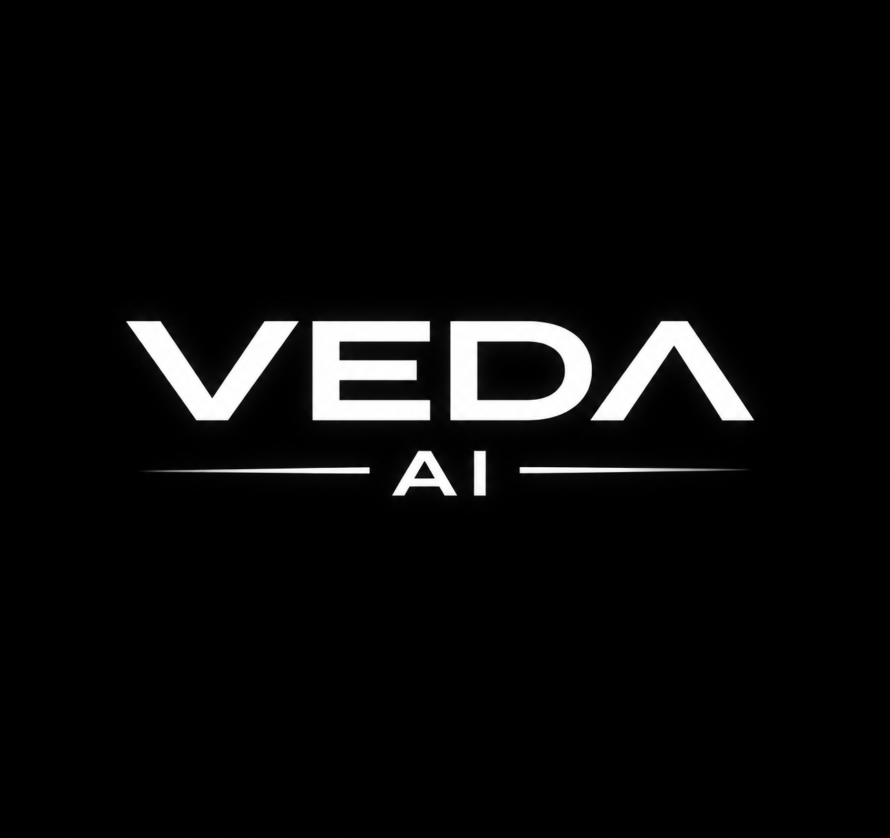
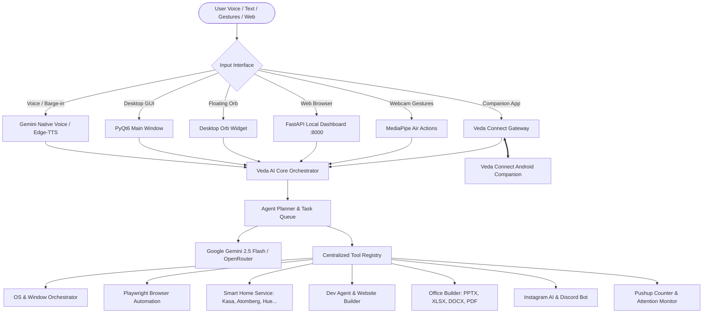

<div align="center">
  

  <h1>VEDA AI</h1>

  <p><strong>Next-Gen Windows Desktop AI Assistant & Intelligent Automation Ecosystem</strong></p>
  <p>Voice-First Native Intelligence · Air Action Gestures · Smart Home IoT · Multi-Device Companion Gateway</p>

  <p>
    <a href="#license"></a>
    <a href="#getting-started"></a>
    <a href="#architecture"></a>
    <a href="#core-capabilities"></a>
    <a href="https://discord.gg/gEYmJKKtq3"></a>
  </p>

  <p>
    <a href="#quick-start"></a>
    <a href="#key-features"></a>
    <a href="#smart-home--iot"></a>
    <a href="#veda-connect--android-companion"></a>
    <a href="#project-structure"></a>
  </p>
</div>

---

## Overview

**Veda AI** is an advanced Windows desktop AI assistant and autonomous agent ecosystem designed for high-performance productivity, hardware control, and multi-device interaction. It pairs a **PyQt6 desktop interface** and a **floating companion orb widget** with multi-modal Google Gemini intelligence, autonomous browser workflows, real-time computer vision, comprehensive smart home control, and an encrypted mobile companion gateway.

Whether automating complex desktop workflows, controlling physical appliances across your home, managing incoming communications, or generating full-stack websites and office documents, Veda operates seamlessly in the background or at your voice command.

---

## Core Capabilities Matrix

| Capability Area | Highlights & Features | Powered By |
|---|---|---|
| **Voice & Interaction** | Gemini Native Live Voice, Edge-TTS synthesis, true speech interruption (barge-in), dynamic noise-gating, proactive interaction | Google Gemini 2.5 Live, Edge-TTS, SoundDevice |
| **Desktop Interfaces** | Full-featured PyQt6 command suite + lightweight draggable **Floating Orb Widget** + Local Web Dashboard | PyQt6, FastAPI, WebSockets |
| **Air Actions (Gestures)** | Touchless webcam hand gesture recognition (palm, swipe, thumbs up/down, peace sign, pinch) | MediaPipe, OpenCV |
| **Smart Home & IoT** | Unified control for smart fans, lights, switches, ACs, and appliances across 8 major ecosystems | Atomberg, Kasa, Hue, LG, Daikin, Tuya, Nest, SmartThings |
| **Veda Connect & Android** | Multi-device companion gateway with QR pairing, Zeroconf mDNS discovery, and native Android agent | FastAPI, WebSockets, Android Gradle, Zeroconf |
| **Encrypted Web Hub** | Local HTTP + WebSocket dashboard on port 8000 with AES-256 encrypted channel & 500MB file transfers | FastAPI, Uvicorn, Cryptography |
| **Developer & Coding Agent** | Multi-step coding agent, Claude Code bridge, automated test runners, traceback diagnosis, and self-fixing code | Gemini Developer Agent, Subprocess |
| **Website & Office Builder** | Autonomous responsive website generation (HTML5/CSS/JS) + PowerPoint (`.pptx`), Excel (`.xlsx`), Word (`.docx`), PDF reports | Python-PPTX, OpenPyXL, Python-DocX, ReportLab |
| **Computer Vision & Fitness** | Live pushup rep counter with motivational voice coach, meal/calorie estimation, posture/attention tracking | MediaPipe Pose, OpenCV, Gemini Vision |
| **Automations & Scraping** | Headless/headed Playwright browser control, window tiling & snap orchestrator, Downloads/Desktop auto-tidy daemon | Playwright, PyAutoGUI, PyGetWindow, PyWinAuto |
| **Social & Remote Bridges** | Instagram DM automation & AI auto-reply, multi-server Discord remote control bot, Spotify & media keys | Instagrapi, Discord.py, Chrome Remote |

---

## Key Features

### 🎙️ Conversational Intelligence & Native Voice
- **Gemini Native Voice Audio**: High-fidelity, low-latency live speech recognition and natural voice synthesis.
- **Resilient AI Failover**: Built with Google Gemini 2.5 as primary intelligence and OpenRouter client fallback resilience for uninterrupted uptime.
- **True Barge-In Interruption**: Instantly interrupts assistant speech when you speak or press a hotkey, backed by dynamic noise-gating.
- **Proactive Assistant Engine**: Context-aware ambient suggestions when your workstation is idle, offering summaries, reminders, or health checks.
- **Smart Memory Manager**: Long-term conversational and preference persistence stored in `workspace_store.py` and `memory/`.

### 🔮 Floating Desktop Companion Widget
- **Always-on-Top Orb**: A sleek, movable circular widget (`desktop_widget.py`) that floats above all applications.
- **Live Reactive Animations**: Visual pulsing and glowing states for `idle`, `listening`, `thinking`, `executing`, and `speaking`.
- **Quick Voice & Text Dictation**: Click or hotkey to trigger instant voice commands or expand the sleek inline text bar.
- **Lightweight Standalone Mode**: Can be launched independently via `start_widget.cmd` or `python main.py --widget`.

### ✋ Air Actions (Touchless Hand Gesture Recognition)
Control music, presentations, volume, and desktop capture without touching the mouse or keyboard (`gesture_utils.py`):
- ✋ **Open Palm**: Play / Pause media playback.
- 👉 **Swipe Right**: Next track or next slide.
- 👈 **Swipe Left**: Previous track or previous slide.
- 👍 **Thumbs Up**: Increase master volume.
- 👎 **Thumbs Down**: Decrease master volume.
- ✌️ **Peace Sign**: Instant desktop screenshot capture.
- 🤏 **Pinch**: Left mouse click / air cursor trigger.

### 🏠 Smart Home & IoT Ecosystem
Manage your entire home through dedicated UI cards (`smart_home_page_new.py`) or natural voice prompts:
- **Atomberg Smart Fans & Appliances**: Direct cloud integration with speed controls, timers, and oscillation.
- **TP-Link Kasa**: Local network discovery and toggle for smart plugs, switches, and multi-color bulbs.
- **Philips Hue**: Bridge synchronization, room grouping, and scene lighting.
- **LG ThinQ**: Status polling and smart appliance controls.
- **Daikin AC**: Climate control, mode switching, and temperature regulation.
- **Tuya / Smart Life**: Broad cloud IoT device connectivity.
- **Google Nest**: Thermostat adjustments and sensor telemetry.
- **Samsung SmartThings**: Multi-device state tracking and remote triggering.

### 📱 Veda Connect & Android Companion
- **Local Device Gateway**: High-speed WebSocket transport layer on your local network (`veda_connect/`).
- **QR-Code Quick Pairing**: Pair Android devices in seconds by scanning the generated QR code.
- **Zeroconf / mDNS**: Automatic local gateway discovery without manual IP configuration.
- **Native Android Agent**: Companion APK (`veda-connect-android`) supporting battery level queries, flashlight toggling, remote URL launching, native app execution, and volume synchronization.

### 🌐 Encrypted Local Web Dashboard (Port 8000)
- **Local Network Access**: Connect from any browser or mobile device on your local WiFi (`http://<PC-IP>:8000`).
- **Application-Layer Encryption**: Secured with AES-256-CBC using session keys.
- **File Transfer Hub**: Drag-and-drop file transfers and remote downloads supporting uploads up to 500MB (`Downloads/Veda Uploads`).
- **Live Assistant Console**: Monitor execution logs, system metrics, and send prompts remotely.

### 💻 Developer Agent & Claude Code Bridge
- **Autonomous Dev Agent**: Generates code, runs terminal build commands, evaluates test outputs, parses traceback errors, and performs self-healing code fixes (`actions/dev_agent.py`).
- **Claude Code Bridge**: Integrated workspace bridge (`actions/claude_code_bridge.py`) for specialized development modes.
- **Full-Stack Website Builder**: Generates production-ready, responsive single-page applications and landing pages with custom themes (split, editorial, command-center, gallery) and an embedded preview server (`actions/website_builder.py`).

### 🏋️ Fitness, Health & Attention Trackers
- **Pushup Rep Counter**: Computer vision workout tracker powered by MediaPipe/OpenCV (`actions/pushup_counter.py`) with real-time rep counting and playful motivational audio commentary.
- **Calorie & Meal Analyzer**: Estimate nutritional information and calorie counts from text or image descriptions (`actions/calorie_counter.py`).
- **Attention & Notification Monitor**: Monitors desktop notifications and incoming communications from Discord, WhatsApp, Telegram, Signal, Teams, Slack, Outlook, and Gmail (`actions/attention_monitor.py`), reading previews aloud via native voice.

### 📄 Office Suite & Document Generation
- **PowerPoint Decks (`.pptx`)**: Generates styled slide decks with titles, bullets, and themes from natural language prompts.
- **Spreadsheets (`.xlsx`)**: Creates structured Excel workbooks with formulas, styling, and data tables.
- **Word Documents (`.docx`)**: Drafts reports, essays, documentation, and summaries.
- **PDF Publishing**: Compiles structured documents and reports into clean, printable PDFs.

### 🤖 OS, Browser & Social Automation
- **Playwright Web Automation**: Headless or visual web scraping, form filling, research, and interactive navigation.
- **Window Orchestrator**: Snap, split, tile, or maximize desktop windows (e.g. split Notepad and Chrome side-by-side).
- **Auto-Tidy Daemon**: Automated background watcher (`actions/auto_tidy_daemon.py`) that organizes incoming downloads and desktop files into categorized folders (Images, Documents, Videos, Code, Archives).
- **Instagram AI Assistant**: State-machine driven daemon (`actions/instagram_chat.py`) for polling DMs, desktop alerts, and autonomous reply drafting.
- **Discord Bot Remote Bridge**: Run Veda from Discord channels or DMs (`discord_bot.py`).
- **Spotify & Media Controller**: Global playback control, playlist queries, and direct track streaming.

---

## Architecture Overview



---

## Getting Started

### System Prerequisites
- **Operating System**: Windows 10 or Windows 11 (64-bit)
- **Python**: Python 3.11 or 3.12 installed and added to `PATH`
- **Node.js**: Node.js 18+ LTS (recommended for web tooling)
- **Git**: Installed and available in terminal
- **API Keys**: Google Gemini API key (required), OpenRouter API key (recommended)

---

### Option A: One-Click Quick Start (Recommended)

Veda AI includes an automated self-elevating setup sequence that checks prerequisites, prepares a virtual environment, installs all pip dependencies, and provisions Playwright browser binaries.

Simply run the batch launcher in PowerShell or Command Prompt:

```cmd
start_veda.bat
```

Or execute the PowerShell bootstrap script directly:

```powershell
Set-ExecutionPolicy -ExecutionPolicy RemoteSigned -Scope Process
.\bootstrap.ps1
```

---

### Option B: Manual Installation

If you prefer to configure your environment step-by-step:

#### 1. Clone the repository
```powershell
git clone https://github.com/rohanvemula279-star/veda-ai.git
cd veda-ai
```

#### 2. Create and activate a Python virtual environment
```powershell
python -m venv .venv
.\.venv\Scripts\Activate.ps1
```

#### 3. Install dependencies
```powershell
python -m pip install --upgrade pip setuptools wheel
pip install -r requirements.txt
playwright install
```

---

### 🔑 API Configuration

Create or edit `config/api_keys.json`:

```json
{
  "gemini_api_key": "YOUR_GEMINI_API_KEY",
  "openrouter_api_key": "YOUR_OPENROUTER_API_KEY",
  "instagram_username": "YOUR_IG_USERNAME",
  "instagram_password": "YOUR_IG_PASSWORD"
}
```

- **Gemini API Key**: Obtain from [Google AI Studio](https://aistudio.google.com/).
- **OpenRouter API Key**: Obtain from [OpenRouter](https://openrouter.ai/) (used as an automated fallback provider).
- **Instagram Credentials** *(Optional)*: Required only if utilizing the Instagram chat daemon.

---

## Running Veda AI

Veda AI provides multiple launch targets depending on your preferred workflow:

### 1. Full Desktop Interface (Standard Mode)
Launches the full PyQt6 visual dashboard with live assistant status, smart home cards, logs, and controls:
```powershell
python main.py
```
*Or double-click `start_veda.bat` / `start_veda.cmd`.*

### 2. Floating Companion Orb (Lightweight Widget)
Launches only the movable, always-on-top desktop orb widget:
```powershell
python main.py --widget
```
*Or execute `start_widget.cmd` or `start_widget.vbs`.*

### 3. Silent Background Startup
Runs the desktop assistant silently in the background without persistent console windows:
```powershell
start_veda.vbs
```

### 4. Local Web Dashboard
The web dashboard initializes automatically with the app, accessible in your browser at:
```
http://localhost:8000
```
*(Or via your computer's local IP address from any phone or tablet on the same Wi-Fi).*

---

## Configuration Reference

| File Path | Description | Key Settings |
|---|---|---|
| `config/api_keys.json` | API keys and integration credentials | `gemini_api_key`, `openrouter_api_key`, `instagram_*` |
| `config/app_settings.json` | Core runtime and UI behavioral flags | `startup_animation_enabled`, `developer_mode_enabled`, `auto_provider_switch` |
| `config/identity.json` | Assistant persona and user identity | `owner.name`, `assistant.name`, `behavior.mode` (`casual`/`professional`) |
| `config/discord_bot.json` | Discord remote control configuration | Discord bot token and authorized channel IDs |
| `config/veda_connect.json` | Device pairing and gateway settings | Gateway port, paired device tokens, discovery flags |
| `config/auto_tidy_config.json`| Rules for file sorting daemon | Target folders, file extension categories, skip rules |

---

## Project Structure

```
veda-ai/
├── actions/                     # Modular automation and domain tools
│   ├── attention_monitor.py     # Posture tracking & desktop message announcements
│   ├── auto_tidy_daemon.py      # Automated Downloads & Desktop file sorter
│   ├── browser_control.py       # Playwright browser automation
│   ├── claude_code_bridge.py    # Developer workspace bridge
│   ├── dev_agent.py             # Autonomous coding, testing & self-fixing agent
│   ├── docx_tools.py            # Word (.docx) generation & summarization
│   ├── file_controller.py       # Local filesystem operations & search
│   ├── gesture_utils.py         # MediaPipe touchless air gesture engine
│   ├── instagram_chat.py        # Instagram DM polling & auto-responder
│   ├── meeting_assistant.py     # Meeting recorder, transcriber & summarizer
│   ├── office_builder.py        # Presentation (.pptx) & Spreadsheet (.xlsx) generator
│   ├── open_app.py              # Windows application launcher & process finder
│   ├── pdf_tools.py             # PDF report creation & manipulation
│   ├── pushup_counter.py        # Computer vision workout & rep counter
│   ├── screen_processor.py      # Multimodal screen vision & context analysis
│   ├── spotify_controller.py    # Universal Spotify & browser media controller
│   ├── website_builder.py       # Full-stack responsive website builder
│   └── window_orchestrator.py   # Desktop window snapping, splitting & tiling
├── agent/                       # Multi-step autonomous agent core
│   ├── error_handler.py         # Self-healing execution recovery
│   ├── executor.py              # Tool execution and verification engine
│   ├── planner.py               # Step-by-step task decomposition
│   └── task_queue.py            # Async execution queue
├── assets/                      # Application icons, logos, and UI graphics
├── config/                      # Local credentials, identities, and settings
├── core/                        # Core assistant orchestration
│   ├── assistant_core.py        # High-level assistant lifecycle
│   ├── identity.py              # Persona and profile manager
│   ├── tool_registry.py         # Centralized tool schemas, risks & handlers
│   └── voice_router.py          # Audio streaming, routing & barge-in logic
├── dashboard/                   # Encrypted local web dashboard (Port 8000)
│   ├── server.py                # FastAPI + WebSocket AES-256 encrypted server
│   └── static/                  # Web dashboard UI assets and scripts
├── memory/                      # Conversational memory and persistent stores
├── smart_home/                  # IoT device service and provider drivers
│   ├── providers/               # Atomberg, Kasa, Hue, LG, Daikin, Tuya, Nest...
│   └── service.py               # Unified smart home device orchestration
├── veda_connect/                # Multi-device WebSocket gateway
├── veda-connect-android/        # Companion native Android project
├── tests/                       # Pytest test suite and regression audits
├── desktop_widget.py            # Floating animated desktop orb widget
├── discord_bot.py               # Discord bot remote control service
├── llm_client.py                # LLM client abstractions
├── or_client.py                 # OpenRouter fallback client
├── main.py                      # Main entry point and lifecycle orchestrator
├── ui.py                        # Primary PyQt6 desktop user interface
├── bootstrap.ps1                # Automated Windows installer & setup script
├── start_veda.bat               # Windows application launcher batch script
├── start_widget.cmd             # Standalone widget launcher script
├── setup.py                     # Quick dependency and Playwright setup script
└── requirements.txt             # Python package dependencies
```

---

## Plugin System & Extensibility

Veda AI supports drop-in modular plugins located in the `plugins/` directory.

### Supported Lifecycle Hooks
- `on_veda_created(veda)`: Called immediately when the assistant instance initializes.
- `on_startup(veda)`: Called once all core services, UI, and tools have loaded.
- `on_text_command(text, source, veda=None)`: Intercepts incoming commands. Return `True` to stop further routing.

### Registering Custom Tools
Custom actions can be registered with the centralized [Tool Registry](file:///c:/Users/rohan/veda-ai/core/tool_registry.py) with built-in schema validation, risk classification, and verification strategies:

```python
from core.tool_registry import tool_registry, ToolDefinition
from core.models import RiskLevel

def my_custom_tool(parameters: dict, player=None, **kwargs):
    target = parameters.get("target")
    return f"Processed {target} successfully."

tool_registry.register(ToolDefinition(
    name="my_custom_tool",
    description="Performs an example custom action.",
    parameters_schema={
        "type": "object",
        "properties": {
            "target": {"type": "string", "description": "Target identifier"}
        },
        "required": ["target"]
    },
    execute_fn=my_custom_tool,
    risk_level=RiskLevel.LOW,
    category="general"
))
```

---

## Testing & Quality Assurance

Veda AI includes an automated test suite covering planner logic, orchestrators, state machines, and integrations.

To execute the test suite:

```powershell
pytest
```

---

## Security & Best Practices

- **Never Commit Credentials**: Keep API keys, bot tokens, and passwords inside `config/api_keys.json` (ignored by git).
- **Local Network Safety**: The Veda Connect gateway and Web Dashboard are designed for secure local area network (LAN) operation. Do not expose port 8000 directly to the public internet without a reverse proxy and authentication layer.
- **Isolated Python Environment**: Always operate inside the `.venv` virtual environment to prevent dependency conflicts.

---

## Community & Support

- **Discord Community**: [Join the Veda Discord Server](https://discord.gg/gEYmJKKtq3) for updates, discussions, and support.
- **Issue Tracker**: Report bugs and request features through GitHub Issues.

---

## License

This project is licensed under the **Veda Source-Available License Version 1.0**. See the [LICENSE](file:///c:/Users/rohan/veda-ai/LICENSE) file for terms and conditions.

## Maintainer & Trademark

- **Author & Maintainer**: Rohan Vemula
- **Trademark Notice**: `Veda`, `Veda AI`, `Veda AI - Lite`, and associated logos are trademarks of Rohan Vemula. See [TRADEMARK.md](file:///c:/Users/rohan/veda-ai/TRADEMARK.md) for usage policy.
